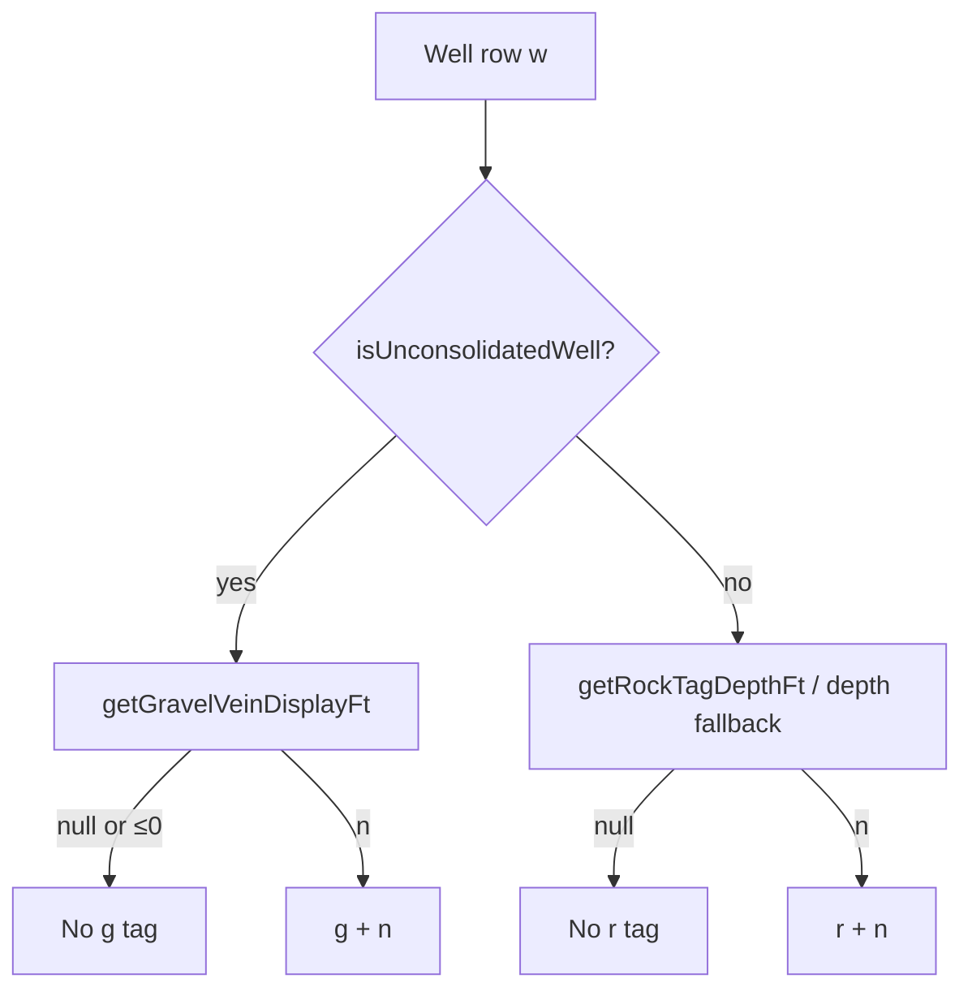

# G-label pipeline — deep analysis

This document explains **why map/list “g” tags often appear missing** even with **enriched chunks** and a **working server**. It is based on a full read of **`index.html`** (map, filters, tag math) and **`build_statewide_data.py`** (chunk semantics).

---

## 1. What “g” is in the UI

- **`gNN`** = gravel / unconsolidated **producing-zone thickness (ft)** on the map chip and in the sidebar list (when present).
- **`rNN`** = bedrock-related depth tag (rock top or fallback), **not** “gravel thickness.”
- Implementation entry points ( **`index.html`** ):
  - **`wellMapGrTag(w)`** → string like `" g12"` or `""`
  - **`wellGrRNumberForTag(w)`** → `{ kind: 'g'|'r', n: number } | null`
  - **`getGravelVeinDisplayFt(w)`** → number | null (only used when **`isUnconsolidatedWell(w)`**)

---

## 2. End-to-end decision flow (conceptual)



**Foundation:** Tags are **only** **g** (gravel / unconsolidated) or **r** (rock path). **`isDryHole`**, **`isBucketWell`**, and other type filters affect **visibility/color** (`passesTypeFilter`, `wellTypeColor`) but **do not** gate **`wellGrRNumberForTag`**.

---

## 3. Historical note — dry/bucket used to suppress g/r (fixed)

Previously **`wellGrRNumberForTag`** returned null for **`isDryHole(w)`** and **`isBucketWell(w)`**. **Current behavior:** only **`isUnconsolidatedWell`** vs bedrock path matters for choosing **g** vs **r**; dry/bucket remain for **filtering** and **styling** only.

---

## 4. Root cause B — placeholder `lithology_json` blocks drift-based `g`

**Location:** `getGravelVeinDisplayFt` (~L1298–L1303).

Drift from registry (`getDriftColumnFtFromCsv`, e.g. `depth_bedrock`) runs **only when**:

```js
var lyr = getLithLayers(w);
if (!lyr || !lyr.length) { ... drift ... }
```

**Build pipeline:** `build_statewide_data.py` **`ensure_one_hundred_percent_lithology_json`** inserts a **synthetic one-interval log** for ~all rows missing real lithology (`lithology_source: none`).

**Effect:** For those ~393k rows (typical statewide build):

- **`getLithLayers(w)`** is a **non-empty array** (the placeholder interval).
- The **drift branch never executes**, even though the “lithology” carries **no usable sand/gravel intervals**.

So **`g` from `depth_bedrock` / drift columns is structurally disabled** for placeholder wells in the viewer, unless another path supplies thickness (vein CSV, real log, or lith math that passes plausibility).

**Mitigation (build + viewer):** `build_statewide_data.bake_registry_vein_for_placeholder_rows` writes **`vein_size_ft`** from **`depth_bedrock`** only when **`lithology_source` is `none`**, aquifer looks unconsolidated (or pass-through inference), **`depth > depth_bedrock`**, and thickness passes the same plausibility rules as the viewer (never **g ≈ completed depth**). The viewer reads **`vein_size_ft`** first and does **not** use completed depth as **g**.

---

## 5. Root cause C — plausibility filter vs lithology math

**Location:** `gThicknessIsPlausibleVsCompletedDepth` (~L1259+), applied to **litho max** and **supplemental CSV** and **drift**.

Placeholder intervals are often **0–depth** with non-material text. Several litho helpers can produce a thickness on the order of **full completed depth**. Those values are **correctly rejected** as misleading **g**.

**Symptom:** Even when layers exist, **`g`** stays empty **by design** unless a thinner interpretable thickness is found.

---

## 6. Root cause D — map rendering: combo vs dot mode (medium / UX)

**Location:** `refreshMap` (~L2548+).

- **Combo markers** (multi-row chips) render when **`getActiveMode()`** is truthy **and** `rowCount >= 1` (elev/yield/type toggles on).
- **Dot markers** append **`extraTag`** (`wellMapGrTag`) **below** the depth dot when `extraTag` is non-empty.

If **`wellMapGrTag` is `""`**, the map shows **depth only** — user perceives “no g labels.”

**Subsampling:** When more than **`maxMarkers` (800)** wells pass filters in view, the code **randomly** keeps 800. That can **remove** wells that would have shown **g** from the visible sample (statistical “sometimes never see g”).

---

## 7. Root cause E — data density vs expectations

From **`verify_vein_g_production.py --all-chunks`** on a typical enriched build:

- **`vein_size_ft > 0`** is a **few percent** of rows (GravelVeinCorrector + screen overlap rules).
- **Chunk 0 alone** can show **zero** positive vein columns because **CSV row order** clusters “uninteresting” rows first.

So **absence of `g` on many gravel-classified wells** can be **data + model**, not only viewer bugs.

---

## 8. Architectural tension (why “short fixes” feel whack-a-mole)

Several **independent subsystems** currently decide the same user-visible outcome:

| Concern | Where it lives |
|--------|----------------|
| Registry completeness | CSV / chunks |
| Vein thickness from logs | `gravel_corrector.py` + `build_statewide_data.apply_vein_from_litho` |
| “Always have lithology JSON” | `build_statewide_data.ensure_one_hundred_percent_lithology_json` |
| Drift / vein / plausibility | `getGravelVeinDisplayFt` + helpers |
| Dry (filter / color only) | `isDryHole` — **not** g/r tags |
| Bucket (filter / color only) | `isBucketWell` — **not** g/r tags |
| Uncon vs rock | `isUnconsolidatedWell` + `aquifer` inference → **g** vs **r** branch |
| Map presentation | `refreshMap` + filters + 800-cap |

**Spec now:** tags follow geology only (**uncon → g**, **rock → r**); **dry/bucket** affect filter/color only.

---

## 9. Recommended directions (choose deliberately — not all compatible)

### Option 1 — **Tag foundation: no dry/bucket gating** — **implemented**

- **`wellGrRNumberForTag`** does not check **`isDryHole`** or **`isBucketWell`** — only **`isUnconsolidatedWell`** (g path) vs rock path (**r**).

### Option 2 — **Treat placeholder lithology as “no lithology” for drift** (viewer or build)

- If `lithology_source === 'none'` **or** formation matches placeholder pattern → allow **`getDriftColumnFtFromCsv`** (subject to plausibility).
- **Risk:** More `g` from registry drift; must keep plausibility tight.

### Option 3 — **Bake drift thickness into chunks** (build)

- During `build_statewide_data`, for rows without real vein, set **`gravel_thickness_ft`** / explicit **`map_g_ft`** from registry drift when safe.
- Viewer already prefers **`vein_size_ft`** then supplemental columns.
- **Risk:** Requires careful definition of “safe” in Python (mirror viewer plausibility).

### Option 4 — **Larger refactor: `TagModel` module**

- Single pure function: input normalized well + flags → `{ g?, r?, reasons[] }`.
- Unit-testable table of fixtures (placeholder litho, no pump, bedrock, etc.).
- **`index.html`** becomes thin UI binding (or generated from a small bundled script).

### Option 5 — **Map sampling**

- Replace random **800** cap with **spatial stratified** sample or **prioritize wells with non-null tags** when downsampling.
- Improves perceived “g coverage” without changing geology math.

---

## 10. Suggested decision order

1. **Data:** Should **placeholder lithology** block **drift**? If **no**, fix **§4** next.
2. **UX:** Address **800 random cap** if dense views hide tagged wells.
3. Tune **GravelVeinCorrector** / rebuild rules for more **`vein_size_ft`** rows as needed.

---

## 11. Verification commands (no code changes)

```bash
cd /Users/dominiceasterling/DNR_Well_Viewer_Full_Demo
python3 verify_vein_g_production.py --all-chunks --chunk dnr_wells_chunk_0.csv.gz
```

In browser console (after load), for a **known ref**:

```js
__cjDebugG('DNR-XXXXXX')
```

Inspect **`uncon`**, **`g_display`**, **`drift_col_csv`**, **`vein_ft_production`**. **Dry/bucket** do not suppress tags.

---

## 12. Change log

- **`wellGrRNumberForTag`:** **`isDryHole`** and **`isBucketWell`** do not suppress tags; foundation is **unconsolidated → g**, **else → r** only.

---

*Generated as part of a structured codebase review: structure + g-label failure modes + architectural options.*
