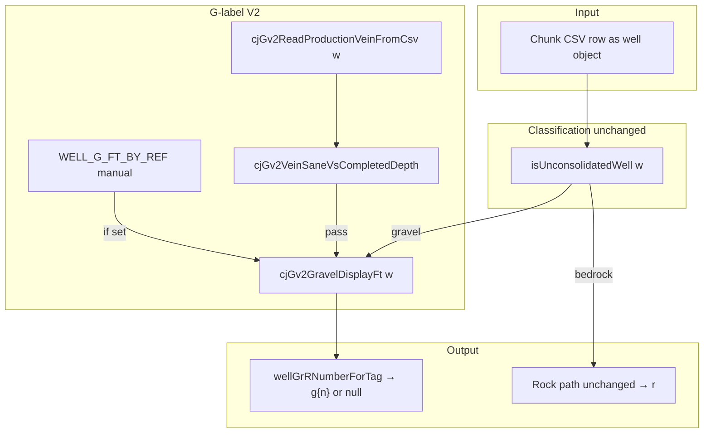

# G-label V2 rebuild — outline and scope

## Purpose

The map/list **g** suffix shows a **footage number** for **unconsolidated (gravel-class) wells**. This rebuild **ignores lithology math, drift columns, and supplemental alias columns** for that number. Only **baked CSV production fields** (`vein_size_ft`, `gravel_thickness_ft`, and strict normalized key matches) plus optional **manual per-ref overrides** feed **g**.

## Goals

1. **Single source of truth** for the numeric **g** value: columns written by the Python bake into chunk CSVs, not client-side log parsing.
2. **Gravel-class only**: use existing `isUnconsolidatedWell(w)` so type filters and **g** tags stay aligned (no second classifier).
3. **Explicit sanity rules** documented in code: positive thickness, not greater than completed depth (registry `depth` only for V2 checks — no litho-derived depth in V2).
4. **Legacy code preserved** in `index.html` inside `if (false) { ... }` blocks so it is **not executed** but remains for diff and rollback.
5. **Operator escape hatch**: `WELL_G_FT_BY_REF` still wins when set.

## Non-goals (muted in V2)

- Inferring **g** from `lithology_json` intervals.
- Using `rock_start_ft` **as** vein thickness (it is depth-to-rock / column top, not producing-zone thickness).
- Supplemental alias columns (`g_ft`, `map_g_ft`, etc.).
- Registry drift column stacking.

## Data flow (diagram)



## Column priority (V2)

1. **`vein_size_ft`** (and keys that normalize to `veinsizeft` / `veinsize`).
2. **`gravel_thickness_ft`** (and `gravelthicknessft` / `gravelthickness`).
3. Nothing else for V2 (no `rock_start_ft` as vein — legacy used it as a fallback; V2 treats it as out of scope for the **g** number).

## Depth sanity

V2 compares vein thickness to the registry **`depth`** field only (`cjGv2CompletedDepthFt`). If **`depth` is missing** on the row, sanity checks **pass through** (vein still displays). Tighten later if you want litho- or casing-derived depth for that case.

## Self-check (run after deploy)

**Automatic:** append `?cj_g_v2_check=1` to the viewer URL after a full chunk load — runs `cjGv2SelfCheck()` once and logs PASS/FAIL.

**Manual:** in the browser console:

```javascript
cjGv2SelfCheck()
```

Expect:

- `manualRefMapOk`: `true` if `WELL_G_FT_BY_REF` is an object.
- `parseSamples`: known strings parse as expected (`"12.5"` → `12.5`, `""` → `null`).
- `saneDepth`: `vein < depth` passes; `vein >= depth` fails; `vein > depth+0.5` fails.
- `syntheticGravelRow`: production vein reads `42` from `vein_size_ft` and passes sanity for `depth: 100`.

Also spot-check:

1. Load production; open DevTools → Network → confirm chunks load.
2. Pick a gravel well with known DNR gravel thickness; compare **g** to `vein_size_ft` / `gravel_thickness_ft` in exported row (or `__cjDebugG('DNR-XXXXX')`).

## Rollback

Set in console (not persisted unless you add it to HTML):

```javascript
window.CJ_G_LABEL_V2 = false;
```

Then reload. **Note:** rollback flag must be wired if we add it; currently V2 is always on and legacy lives only inside `if (false)`.

---

*Document version: 2026-04-05 — matches `APP_BUILD_STAMP` in `index.html`.*
